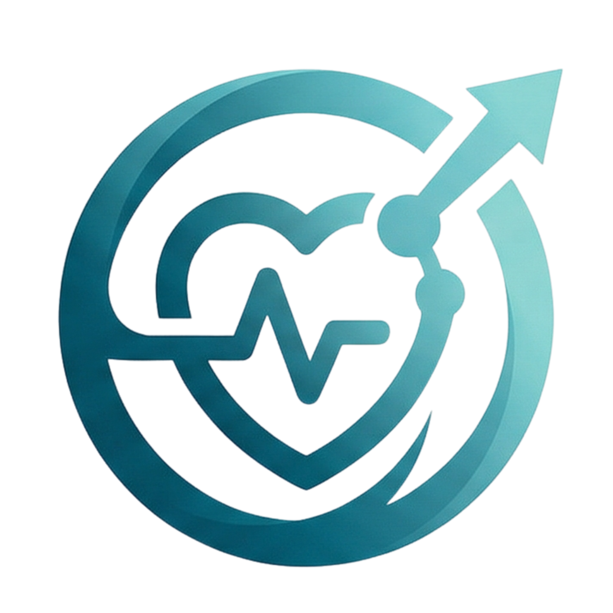

<p align="center">
  
</p>

<h1 align="center">OmniCare</h1>

<p align="center">
  <strong>Smart Post-Discharge Recovery Companion</strong><br/>
  A comprehensive HealthTech platform for patients, doctors, and caregivers to monitor and manage post-surgical recovery collaboratively.
</p>

<p align="center">
  <a href="https://omnicare-olive.vercel.app">Live Demo</a>
</p>

---

## Overview

OmniCare bridges the gap between hospital discharge and full recovery. Post-surgical patients often struggle with medication adherence, symptom tracking, and follow-up compliance at home. OmniCare provides a unified platform where:

- **Patients** track their recovery, log symptoms, and follow personalized plans
- **Doctors** monitor patient progress, write recommendations, and manage medications remotely
- **Caregivers** validate task completion, receive escalated alerts, and stay informed with doctor notes

The platform implements a **three-way communication architecture** where data flows seamlessly between all three roles with built-in validation, escalation, and notification systems.

---

## Architecture & Data Flow

```
                    Writes Notes & Recommendations
                    Manages Medications (Add/Edit/Delete)
                    Views Reports, Photos, Alerts
                    ┌──────────┐
         ┌─────────┤  DOCTOR  ├─────────┐
         │         └────┬─────┘         │
         │              │               │
    Escalated      Notes visible   Views All
    Alerts         to both         Caregivers
         │              │               │
         │         ┌────▼─────┐         │
         ├─────────┤CAREGIVER ├─────────┤
         │         └────┬─────┘         │
         │              │               │
         │       Approves/Rejects       │
         │       Patient Tasks          │
         │              │               │
         │         ┌────▼─────┐         │
         └─────────┤ PATIENT  ├─────────┘
                   └──────────┘
              Logs Symptoms, Photos
              Marks Tasks (Pending Approval)
              Uses Voice Assistant
              Views Doctor Recommendations
```

### Key Flows

**Task Validation Flow:**
Patient marks task done → Status becomes "Pending Approval" → Caregiver sees it in approval queue → Caregiver Approves/Rejects → Doctor sees verified data only

**Alert Escalation Flow:**
Symptom spike detected → Alert created → If unacknowledged for 30 min → Auto-escalated to Caregiver → If still unacknowledged for 1 hour → Auto-escalated to Doctor

**Photo Analysis Flow:**
Patient uploads wound photo → AI canvas-based analysis (red pixel ratio detection) → Result: Healing Well / Monitor Closely / Needs Attention → If concerning → Critical alert auto-sent to Doctor

---

## Features (17 USPs)

### 1. Personalized Recovery Plans
Recovery plans with 4 phases (Acute Recovery, Early Rehabilitation, Strength Building, Full Recovery), each with categorized tasks (exercise, wound care, diet, medication, rest, follow-up). Plans vary by surgery type and patient condition.

### 2. Symptom-Based Alert System
Rule-based symptom analysis that triggers alerts for:
- Pain spikes (increase of 3+ points)
- Elevated temperature (>100.4 F)
- Trending worse (3 consecutive pain increases)
- Low mobility combined with high pain

### 3. Caregiver Visibility
Full caregiver dashboard with multi-patient monitoring, symptom charts, recovery scores, medication tracking, and real-time alert management.

### 4. Medication & Task Reminders
Time-based medication reminder notifications that detect upcoming/past-due doses and show actionable toast notifications with "Mark as Taken" buttons.

### 5. Follow-Up Tracking
Dedicated follow-up appointment system with:
- Next appointment hero card with countdown
- Preparation tips per appointment
- Doctor name, specialization, location details
- Status tracking (Confirmed / Pending / Rescheduled)

### 6. Simple Home-Recovery UX
Clean, large-touch-friendly interface with high contrast, clear typography, responsive layout, and minimal cognitive load. Designed for elderly and low-tech users.

### 7. Multimodal Patient Monitoring
- **Symptom Form**: 8 sliders (pain, swelling, mobility, mood, fatigue, appetite, breathing, temperature)
- **Voice Input**: Speak commands in English or Hindi
- **Photo Capture**: Wound/incision photo upload with AI analysis
- **Activity Logs**: Steps, rest hours, water intake tracking

### 8. Voice-First Interaction
Full voice assistant supporting:
- English and Hindi speech recognition (Web Speech API)
- Hindi voice output with proper hi-IN locale
- 15+ command categories with Devanagari keyword matching
- Quick command buttons for common actions
- Context-aware responses (references recovery score, doctor notes)

### 9. Multilingual Support (English + Hindi)
- 200+ translation keys covering every UI element
- Language toggle in top bar AND inside tutorial tour
- Date formatting adapts to locale
- Voice assistant responds in active language
- Instant switching — no page reload

### 10. Low-Friction Daily Check-In
3-step Quick Check-in modal:
1. Mood selection (emoji: Great / Okay / Not Good)
2. Pain level slider (0-10)
3. Optional notes

Completes in under 30 seconds. Auto-generates symptom log entry.

### 11. Recovery Timeline & Milestones
- Achievement badges with unlock tracking (e.g., "First Steps Post-Surgery", "Pain Below 5/10", "7-Day Medication Streak")
- Progress bar showing overall milestone completion
- Weekly steps bar chart in Activity Log
- 7-day symptom trend line charts

### 12. Smart Escalation
Automatic alert escalation chain:
- Level 1: Patient Self-Action (15 min)
- Level 2: Caregiver notified (30 min)
- Level 3: Doctor notified (Immediate for critical)

Visual escalation chain displayed on doctor dashboard.

### 13. Health-Specific Voice Companion
Not a generic chatbot — a recovery-specific assistant that says:
- "Take your medicine now"
- "Please rest and drink water"
- "Your symptoms should be monitored"
- Understands Hindi: "दवाइयां दिखाइए", "दर्द 5 दर्ज करो", "कैलेंडर खोलो"

### 14. Doctor Summary Report
Printable daily/weekly patient report containing:
- Patient demographics and key metrics
- Symptom overview table
- Alert summary with severity counts
- Active medications list
- AI-generated recommendations
- Report ID and timestamp

### 15. Recovery Journey Visualization
- Circular progress ring (recovery score 0-100)
- Phase timeline with completion status
- Weekly activity bar charts
- Milestone achievement badges
- Color-coded risk and severity indicators

### 16. Smart Calendar Integration
Week-strip calendar with:
- Color-coded events (Medication, Exercise, Appointment, Check-in, Reminder)
- Event dots per day showing activity density
- Today's schedule with completion tracking
- Upcoming appointments preview
- Seeded demo data for all patients

### 17. Doctor Notes & Recommendations
Bidirectional notes system:
- Doctor writes notes (Recommendation, Medication Change, Comment, Alert Response)
- Notes categorized (General, Exercise, Medication, Diet, Activity, Symptom)
- Visible to patient on dashboard and to caregiver in notes tab
- Searchable "All Notes" page grouped by date
- Notes appear in bell notifications for patients and caregivers

---

## Additional Features

### Task Validation System
Patients cannot self-verify task completion. When a patient marks a task done:
- Task enters "Pending Approval" state (amber clock icon)
- Caregiver receives it in their approval queue
- Caregiver approves (verified complete) or rejects (reset to incomplete)
- Doctor only sees caregiver-validated data

### Medication Management (Doctor)
Doctors can add, edit, and delete patient medications with:
- Confirmation modal for every action (Add/Edit/Delete)
- Fields: name, dosage, frequency, time schedule, instructions
- Real-time adherence tracking per medication

### Wound Photo AI Analysis
Canvas-based image analysis:
- Draws uploaded image at 50x50 pixels
- Samples all pixel data for red-dominant channel ratio
- Red ratio >15% = "Needs Attention" (auto-alerts doctor)
- Red ratio >5% = "Monitor Closely"
- Otherwise = "Healing Well"

### Guided Tutorial Tour
Clash-of-Clans-style onboarding walkthrough:
- SVG mask cutout spotlight on target elements
- Animated tooltip with progress bar
- Back / Next / Skip navigation
- Inline language toggle (switch EN/Hindi mid-tour)
- Smart positioning — tooltip never goes off-screen
- 11 steps for patient, 7 for doctor, 7 for caregiver
- Auto-launches on first login, persists completion

### All Caregivers View (Doctor)
Searchable table of all caregivers with:
- Name, email, assigned patient count
- Click to expand showing assigned patients
- Enables doctor-caregiver coordination

---

## Tech Stack

| Layer | Technology |
|-------|-----------|
| Framework | Next.js 16.2 (App Router) |
| UI | React 19, Tailwind CSS 4 |
| Animations | Framer Motion |
| Charts | Recharts |
| Icons | React Icons (Feather) |
| Voice | Web Speech API (SpeechRecognition + SpeechSynthesis) |
| Storage | localStorage (prototype — no backend) |
| Deployment | Vercel |

---

## Project Structure

```
src/
├── app/                          # Next.js App Router pages
│   ├── login/page.js             # Immersive auth page
│   ├── patient/
│   │   ├── page.js               # Patient dashboard
│   │   ├── symptoms/page.js      # Symptom tracking + photo upload
│   │   ├── medications/page.js   # Medication schedule
│   │   ├── recovery-plan/page.js # Recovery phases + tasks
│   │   ├── calendar/page.js      # Smart calendar
│   │   └── follow-ups/page.js    # Appointment tracking
│   ├── doctor/
│   │   ├── page.js               # Doctor dashboard (aggregate stats)
│   │   ├── patients/page.js      # All patients (search + detail)
│   │   ├── caregivers/page.js    # All caregivers
│   │   └── notes/page.js         # All notes (searchable)
│   └── caregiver/
│       ├── page.js               # Caregiver dashboard + task approvals
│       ├── patients/page.js      # Patient list + detail
│       └── notes/page.js         # Doctor notes viewer
├── components/
│   ├── common/                   # Shared UI (Card, Badge, TutorialTour, etc.)
│   ├── layout/                   # Sidebar, TopBar, AppLayout
│   ├── patient/                  # Patient-specific components
│   ├── doctor/                   # PatientDetailView, SummaryReport
│   └── voice/                    # VoiceAssistant
├── context/                      # AuthContext, LanguageContext, NotificationContext
├── data/                         # Mock data + translations + tour steps
├── hooks/                        # useVoiceAssistant, useSymptomAnalysis
├── services/                     # storageService, escalationService
└── utils/                        # dateHelpers, recoveryScoring
```

---

## Demo Credentials

| Role | Email | Password |
|------|-------|----------|
| Patient | rajesh@demo.com | any |
| Patient | anita@demo.com | any |
| Patient | mohammed@demo.com | any |
| Doctor | drmeera@demo.com | any |
| Doctor | drarjun@demo.com | any |
| Caregiver | priya@demo.com | any |
| Caregiver | sana@demo.com | any |

> Use the **Quick Demo Access** buttons on the login page for one-click login.

---

## Getting Started

### Prerequisites
- Node.js 18+
- npm or yarn

### Installation

```bash
git clone https://github.com/Anexus5919/OmniCare.git
cd OmniCare
npm install
```

### Development

```bash
npm run dev
```

Open [http://localhost:3000](http://localhost:3000) in your browser.

### Production Build

```bash
npm run build
npm start
```

### Deploy to Vercel

```bash
npx vercel --prod --yes --name omnicare
```

---

## Demo Walkthrough (for Video)

### Patient Flow
1. Login as Patient (rajesh@demo.com) → Tutorial tour auto-starts
2. Complete Quick Check-in (mood + pain)
3. View Symptom Trends chart
4. Mark a task in Daily Tasks → Shows "Pending Approval"
5. Go to Symptoms → Upload wound photo → See AI analysis
6. Open Calendar → View today's schedule
7. Open Follow-ups → See upcoming appointments with prep tips
8. Use Voice Assistant → Say "दवाइयां दिखाइए" (Hindi) or "Show medications"
9. Switch language to Hindi → Entire UI translates
10. View Doctor's Recommendations on dashboard

### Doctor Flow
1. Login as Doctor (drmeera@demo.com) → Tutorial tour
2. Dashboard shows aggregate stats, charts, escalation banner
3. Go to All Patients → Click Rajesh Kumar
4. Overview tab: symptom chart, activity log, patient photos
5. Medications tab: Add new medication → Confirmation modal
6. Notes tab: Write a recommendation → Visible to patient and caregiver
7. Generate Report → Printable summary with AI recommendations
8. Go to All Caregivers → View caregiver assignments

### Caregiver Flow
1. Login as Caregiver (priya@demo.com) → Tutorial tour
2. See Pending Task Approvals → Approve/Reject patient tasks
3. Click patient card → Tabbed view (Overview, Medications, Doctor Notes, Follow-ups)
4. View Doctor Notes → See recommendations written by doctor
5. Generate Report for patient
6. Bell icon shows doctor notes as notifications

---

## Recovery Scoring Algorithm

```
Recovery Score (0-100) =
  Task Completion (40%)     — completed tasks / total tasks
  Symptom Trajectory (30%)  — pain trend + average pain level
  Medication Adherence (20%) — taken doses / total doses
  Check-in Consistency (10%) — unique check-in days / days since discharge
```

---

## License

This project is a hackathon prototype built for demonstration purposes.

---

<p align="center">
  Built with Next.js, React, and Tailwind CSS<br/>
  <strong>OmniCare</strong> — Recovery, reimagined.
</p>
